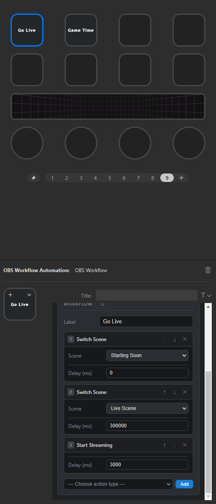

# OBS Workflow Automation (OBSWA)

> A Zapier-inspired workflow automator for Stream Deck and OBS Studio.

**OBSWA** lets you chain multiple OBS actions together and fire the entire sequence from a single Stream Deck button press. Think of it as Zapier, but for your stream — switch scenes, toggle sources, mute audio, trigger hotkeys, start/stop recording, and more, all in one tap.

---

## Features

- **Workflow builder** — Add, reorder, and delete actions directly in the Stream Deck Property Inspector
- **14 action types** — Scene switching, source visibility, muting, streaming, recording, hotkeys, text sources, and timed delays
- **Global OBS connection** — Configure your OBS WebSocket credentials once; every OBSWA button on your deck shares the connection automatically
- **Live OBS data** — Scenes, sources, and hotkeys populate into dropdowns automatically when connected
- **Reliable execution** — Actions run sequentially with per-action error reporting; a failed step doesn't cancel the rest of the workflow
- **Double-trigger protection** — Pressing a button while a workflow is already running is safely ignored
- **Reconnect on drop** — Exponential back-off reconnect keeps the connection alive without hammering OBS
- **Security-first** — Passwords never appear in logs; host validation prevents SSRF abuse; the Property Inspector's Content Security Policy blocks all external requests

## Supported Action Types

| Action | Description |
| -------- | ------------- |
| Switch Scene | Transition to a named scene |
| Toggle Source | Toggle a source's visibility on/off |
| Set Source Visibility | Explicitly show or hide a source |
| Mute Source | Mute an audio source |
| Unmute Source | Unmute an audio source |
| Toggle Mute | Flip the mute state of an audio source |
| Start Streaming | Begin the stream |
| Stop Streaming | End the stream |
| Start Recording | Begin recording |
| Stop Recording | Stop recording |
| Toggle Recording | Flip recording on/off |
| Trigger Hotkey | Fire an OBS hotkey by name |
| Set Text Source | Update a text source's content |
| Wait | Pause for a set number of milliseconds before the next action |

## Requirements

- [Stream Deck](https://www.elgato.com/en/stream-deck) hardware + software (v6.4+)
- [OBS Studio](https://obsproject.com/) with the **WebSocket server enabled** (built-in since OBS 28)
  - OBS → Tools → WebSocket Server Settings → Enable WebSocket server
  - Default port: `4455`

## Installation

> **Note:** OBSWA is currently in active development and is not yet published to the Elgato Marketplace. Watch this repo for release updates.

Once released, you will be able to install it directly from the Elgato Marketplace. A manual `.streamDeckPlugin` install option will be provided with each GitHub release.

## Connecting to OBS

1. Drag the **OBS Workflow** action onto any Stream Deck button
2. Open the Property Inspector (click the button in Stream Deck software)
3. Enter your OBS WebSocket settings:
   - **Host:** `localhost` (or the IP of your OBS machine on the network)
   - **Port:** `4455`
   - **Auth:** Enable and enter your password if OBS requires one
4. Click **Test Connection** — the indicator turns green when connected
5. The connection is shared across all OBSWA buttons; you only set it once

## Building a Workflow

1. Connect to OBS (above)
2. Give the workflow a **label** — this appears as the button title on your deck
3. Click **Add Action**, choose an action type from the dropdown
4. Fill in the action's fields (scenes/sources populate from your live OBS)
5. Add more actions, reorder with ↑ / ↓, remove with ✕
6. Settings save automatically — no submit button needed

## Example Workflow

The screenshot below shows a **"Go Live"** workflow configured to run three actions from a single Stream Deck button press:

1. **Switch Scene** → `Starting Soon` (immediately, no delay)
2. **Switch Scene** → `Live Scene` (after a 300,000 ms / 5-minute delay)
3. **Start Streaming** (after an additional 3,000 ms delay)

---

## Project Status

🚧 **In active development** — core functionality is working but the plugin has not yet been submitted to the Elgato Marketplace. Testing is ongoing before the first public release.

Areas currently being worked on:

- Further real-world testing and edge case hardening
- Icon artwork (current icons are placeholders)
- Marketplace submission preparation

## Contributing

Issues and pull requests are welcome. If you find a bug or have a feature idea, please open an issue on [GitHub](https://github.com/DreadHeadHippy/OBSWA/issues).

See [CONTRIBUTING.md](CONTRIBUTING.md) for full contribution guidelines including code style, project structure, and the PR process.

For security vulnerabilities, please follow the responsible disclosure process in [SECURITY.md](SECURITY.md) rather than opening a public issue.

## License

MIT — see [LICENSE](LICENSE) for details.

---

Built with ❤︎⁠ by **DreadHeadHippy**.
